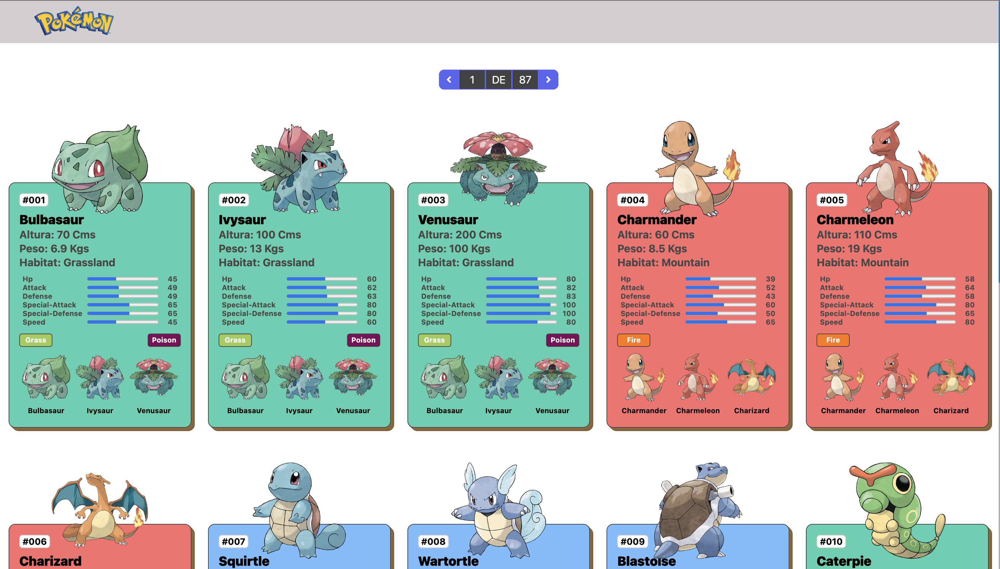

# 🧿 Pokédex React

> ⚠️ **Nota:** Este proyecto está en proceso de mejora continua y aún contiene bugs pendientes de corregir. ¡Gracias por tu comprensión y paciencia!

Una Pokédex web hecha con **React + Vite**, que consume datos en tiempo real desde la [PokéAPI](https://pokeapi.co/). Permite buscar, explorar y visualizar información detallada de los Pokémon.


---

## 📸 Capturas



---

## 🚀 Funcionalidades

- 🔍 **Búsqueda** de Pokémon por nombre o ID
- 📄 **Vista detallada** con imagen, tipo, habilidades y estadísticas
- 📱 **Responsive design** para móviles y escritorio
- ⚡ **Carga dinámica** desde la PokéAPI
- 🧰 **Código limpio y organizado** con ESLint y SCSS

---

## 🧪 Stack técnico

| Tecnología      | Descripción                                 |
| --------------- | ------------------------------------------- |
| **TypeScript**  | Superset de JavaScript para tipado estático |
| **React 18**    | Librería principal para construir la UI     |
| **Vite 5**      | Bundler y entorno de desarrollo rápido      |
| **Axios**       | Cliente HTTP para llamadas a la PokéAPI     |
| **Sass (SCSS)** | Preprocesador CSS                           |
| **ESLint**      | Linter de código JavaScript/React           |

---

## 📦 Instalación

```bash
# 1. Clonar el repositorio
git clone https://github.com/PabloGarRod/pokedex-react.git
cd pokedex-react

# 2. Instalar dependencias
npm install

# 3. Ejecutar el servidor de desarrollo
npm run dev
```
